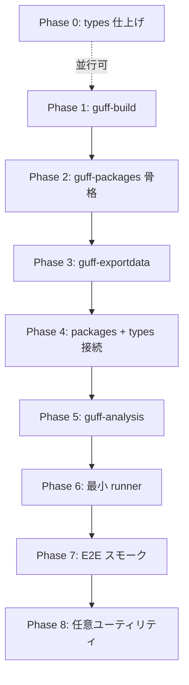

# guff — linter 移植前タスク計画書

> **目的**: staticcheck 等の個別 linter を Rust で移植する**前**に、golangci-lint が依存する
> 「プロジェクト全体の読み込み」と「解析フレームワーク」を guff 上に揃える。
>
> **使い方（今後のセッション向け）**:
> 1. この文書の **§3 進捗サマリ** と **§4 タスク一覧** を開く。
> 2. 未着手のうち **依存関係が満たされている最上位タスク** を 1 つ（多くても 2 つ）選ぶ。
> 3. 作業後、該当タスクの `[ ]` を `[x]` にし、§3 の表とテスト件数を更新する。
> 4. deferral を作ったら §5 に追記する。
>
> **関連文書**:
> - `MIGRATION.md` — `guff-types` 移植（ほぼ完了）
> - `projects/guff-ssa-MIGRATION.md` — `guff-ssa` 移植（Milestone A–F 完了）
> - `docs/STATICCHECK-MIGRATION.md` — **Staticcheck 個別ルール移植の進捗・残タスク**（Phase 7 完了後）
> - `docs/LINTER-MIGRATION.md` — **govet / errcheck 等マルチ linter 移植の全体計画**（Phase 7 完了後）
>
> **リポジトリ**: `/Users/dakimura/projects/src/github.com/dakimura/me/projects/guff`
> **Go 参照 SDK**: `/Users/dakimura/sdk/go1.26.4`（バージョンが変わったら §0 を更新）

---

## 0. 前提（2026-07-12 時点）

### 0.1 ゴール

golangci-lint の Rust 移植。個別 linter より先に、次のパイプラインを end-to-end で動かす:

```
go list / module graph
    → パッケージ列挙・依存解決・ビルドタグ適用
    → 型チェック（source または export data）
    → go/analysis Pass 生成
    → 複数 Analyzer の並列実行・診断収集
```

### 0.2 移植済み（触らない／壊さない）

| クレート | Go 相当 | 状態 |
|---------|---------|------|
| `guff-ast` | `go/token`, `go/scanner`, `go/ast`, `go/parser`, `go/ast/*` 一部 | 移植済み（walk/filter/import/commentmap/constraint 含む） |
| `guff-constant` | `go/constant` | 移植済み |
| `guff-types` | `go/types`（移植元は `types2`） | チェッカ完走・~750+ tests |
| `guff-types-errors` | `internal/types/errors` | 移植済み |
| `guff-ssa` | `golang.org/x/tools/go/ssa` + `ssautil` | Milestone A–F 完了・150 tests |
| `guff-gover`, `guff-goversion`, `guff-version` | `internal/gover`, `internal/goversion` | 移植済み |

### 0.3 未着手（本計画の対象）

| 層 | Go パッケージ | 新クレート候補 |
|----|--------------|---------------|
| ビルドコンテキスト | `go/build` | `guff-build` |
| パッケージロード | `golang.org/x/tools/go/packages` | `guff-packages` |
| export data | `golang.org/x/tools/go/gcexportdata` | `guff-exportdata` |
| 解析 API | `golang.org/x/tools/go/analysis` | `guff-analysis` |
| runner（golangci 固有） | `golangci-lint/pkg/goanalysis` | `guff-lint` または `guff-runner` |
| 仕上げ（linter ごと） | `go/format`, `go/doc/comment` 等 | 必要時に追加 |

### 0.4 作業の鉄則（MIGRATION.md 踏襲）

1. **1 セッション = タスク 1 個**（ファイル 1〜2 個まで。例外は §4 各タスクに明記）。
2. **Go ソースが唯一の正解**。実装前に必ず該当 `.go` を `Read` する。
3. **既存 guff の慣習に合わせる**（arena + ID、テストは `tests/*.rs`、chunk コミット）。
4. **毎回ビルドとテストを通す**。件数を §3 に記録。
5. **コミットはユーザーが依頼したときだけ**。push はしない。
6. **わからない所は deferral**（§5 に追記。黙って省略しない）。

### 0.5 毎回のコマンド

```bash
. "$HOME/.cargo/env"
cd /Users/dakimura/projects/src/github.com/dakimura/me/projects/guff

# 作業クレート（例）
cargo build -p guff-packages
cargo test  -p guff-packages

# 回帰（大きな変更のとき）
cargo test -p guff-types -p guff-ssa -p guff-ast -q
```

---

## 1. 推奨実装順序（全体像）



| Phase | 概要 | linter 着手のブロッカーか |
|-------|------|------------------------|
| 0 | `guff-types` の実プロジェクト向け deferral 回収 | 一部（typecheck 品質） |
| 1 | ビルドタグ・ファイル選別・ImportPath | **Yes** |
| 2 | `go/packages` 相当のデータモデルと `go list` ドライバ | **Yes** |
| 3 | export data 読み書き | **Yes**（性能・互換） |
| 4 | packages → Checker / export importer 接続 | **Yes** |
| 5 | `go/analysis` の `Analyzer`/`Pass`/`Diagnostic` | **Yes** |
| 6 | 並列 runner・load mode 合成 | **Yes** |
| 7 | サンプル analyzer 1〜2 個で E2E | 完了判定 |
| 8 | gofmt 等 | No（linter ごとに後追い可） |

---

## 2. 設計方針（セッションで迷ったらここに戻る）

### 2.1 `guff-packages` は最初 `go list` ラッパから始める

完全な pure-Rust module graph は工数が大きい。**第 1 段階**は Go ツールチェインの `go list -json` を subprocess で呼び、JSON を `guff_packages::Package` にデシリアライズする。

- **理由**: golangci-lint も実質 `go/packages` → `go list` 依存。互換性と開発速度を優先。
- **第 2 段階（defer）**: `go.mod` を直接読む pure Rust（オフライン・go 無し環境用）は Phase 2 完了後に検討。

`go list` 呼び出しの典型:

```bash
go list -json -compiled -deps -test=false ./...
```

テスト用パッケージが要る linter 向けには別モードで `-test` を付ける（§4 Phase 2 の P2-e）。

### 2.2 `Package` は Go の `packages.Package` に寄せる

golangci-lint / `go/analysis` が期待するフィールドをそのまま持つ（ポインタは `Option` / ID）:

- 識別: `ID`, `Name`, `PkgPath`, `Module`, `Imports`, `Deps`
- ソース: `GoFiles`, `CompiledGoFiles`, `OtherFiles`, `IgnoredFiles`
- 型情報: `Types`, `TypesInfo`, `TypesSizes`, `Fset`, `Syntax`, `IllTyped`
- export: `ExportFile`, `ExportData`（Phase 3 以降）

`guff-types` の `PackageId` / arena とは **別レイヤ**の `guff_packages::Package` とし、必要なら `TypePackageId` をオプションで保持。

### 2.3 export data と source の二段構え

golangci-lint の `loadingPackage` と同様:

1. **解析対象パッケージ（initial）**: ソースから `guff::parser` → `Checker::check_files`
2. **依存パッケージ**: `ExportFile` があれば `guff-exportdata` で `types.Package` 相当を構築し `Importer` に接続
3. 無ければ source fallback（既存 `add_dependency_source` 経路）

### 2.4 `guff-analysis` の `Pass` は Go に合わせたファサード

```rust
pub struct Pass<'a> {
    pub analyzer: &'a Analyzer,
    pub fset: &'a FileSet,
    pub files: &'a [File],
    pub pkg: &'a packages::Package,
    pub types_info: &'a Info,
    pub types_sizes: &'a dyn Sizes,   // guff_types::Sizes
    pub result_type: &'a mut Vec<Diagnostic>,
    // Facts / OtherFields は Phase 5 で追加
}
```

Analyzer 関数シグネチャは `fn(pass: &mut Pass) -> Result<(), String>` のように **エラーを文字列 or 専用型**で返す（Go の `error` 相当）。

### 2.5 テスト戦略の三層

| 層 | 内容 | 使う場面 |
|----|------|---------|
| **Unit** | 小さな fixture ディレクトリ + `insta` or 手書き assert | build constraint, JSON パース, exportdata 1 ファイル |
| **Integration** | 一時ディレクトリに `go mod init` した mini module を作り `go list` / loader を実行 | packages loader |
| **Golden / E2E** | 既知の analyzer を 1 個走らせ診断 JSON を比較 | Phase 7 |

Integration テストは **`GO` バイナリが PATH にあること**を前提にし、無い環境では `#[ignore]` + `cargo test -- --ignored` で手動実行（テスト冒頭で `which go` を確認）。

Fixture の置き場所: `crates/<crate>/tests/testdata/<case>/`

---

## 3. 進捗サマリ（セッション終了時に更新）

| Phase | 状態 | テスト数（該当クレート） | 最終更新 |
|-------|------|-------------------------|---------|
| 0 — types 仕上げ | 未着手 | guff-types: （既存のまま） | — |
| 1 — guff-build | 完了 | guff-build: 33 | 2026-07-12 |
| 2 — guff-packages | 完了 | guff-packages: 23 | 2026-07-12 |
| 3 — guff-exportdata | 完了 | guff-exportdata: 1 | 2026-07-12 |
| 4 — packages↔types | 完了 | guff-packages: 30（+7）/ guff-ssa +1 | 2026-07-12 |
| 5 — guff-analysis | 完了 | guff-analysis: 9 | 2026-07-12 |
| 6 — runner | 完了 | guff-runner: 5 | 2026-07-12 |
| 7 — E2E スモーク | 完了 | guff-runner: 7（+2）/ guff-analysis: 12（+3） | 2026-07-12 |
| 8 — 任意ユーティリティ | 未着手 | — | — |
| **SC — Staticcheck ルール** | **進行中** | **guff-staticcheck: 41**（12 ルール） | 2026-07-12 |

**Staticcheck 移植の詳細**: [`docs/STATICCHECK-MIGRATION.md`](docs/STATICCHECK-MIGRATION.md) を参照。

**ワークスペース回帰（参考・2026-07-12）**: `guff-types` 多数 / `guff-ssa` 150 / `guff-ast` 既存

---

## 4. タスク一覧

記法: `[ ]` 未着手 / `[~]` 進行中 / `[x]` 完了

---

### Phase 0 — `guff-types` 仕上げ（並行可能・linter 品質向け）

> linter 基盤のブロッカーではないが、**typecheck linter** や実プロジェクトで早く効く項目。
> `MIGRATION.md` §8 の deferral と対応づけ。

#### [x] P0-a — `initorder` を `check_files` に配線

- **Go ソース**: `initorder.go`, `check.go`（`initOrder` 呼び出し）
- **触るファイル**: `guff-types/src/check.rs`, `guff-types/src/initorder.rs`（既存）
- **実装**:
  - `check_files` 末尾（`monomorph` の前後は Go の順序を確認）で `compute_init_order` を呼ぶ
  - `Info.init_order` に結果を格納
- **テスト** (`tests/initorder.rs` 拡張 or `check_files.rs`):
  - `var a = b; var b = 1` → `InvalidInitCycle`
  - `var a = 1; var b = a` → 順序 `[b, a]` 相当
- **deferral**: 多行 cycle メッセージは簡略のままで可

#### [x] P0-b — `:=` 再宣言（`no new vars`）検査

- **Go ソース**: `assignments.go`（short variable declaration）
- **触るファイル**: `guff-types/src/check_assign.rs`
- **実装**: `short_var_decl` で右辺スコープに新規名が無い場合 `NoNewVars`（Go と同コード）
- **テスト**: `x := 1; x := 2` → エラー / `x, y := 1, 2` で `y` のみ新規 → OK

#### [x] P0-c — type switch 束縛変数の cross-clause 使用検査

- **Go ソース**: `stmt.go`（`typeSwitchStmt` の usage）
- **触るファイル**: `guff-types/src/stmt.rs`
- **実装**: 各 clause 終了時に束縛変数の使用を検証（chunk 36 の exempt を撤去）
- **テスト**: `switch v := x.(type) { case int: _ = v; case string: }` → `v` 未使用エラー

#### [x] P0-d — cgo `import "C"` の最小スタブ

- **Go ソース**: `check.go`（cgo 分岐）, `resolver.go`
- **触るファイル**: `guff-types/src/resolver.rs`, `guff-types/src/check.rs`
- **実装**: `import "C"` を検出したら `FakeImportC` 相当でパッケージを合成（完全 cgo 前処理は defer）
- **テスト**: `import "C"` を含むファイルが panic せず、型チェックが続行 or 期待どおりのエラー

#### [x] P0-e — `FileVersions` 記録

- **Go ソース**: `recording.go`, `check.go`（`initFiles`）
- **触るファイル**: `guff-types/src/api.rs`, `recording.rs`, `check.rs`
- **実装**: ファイルごとの Go バージョン文字列を `Info.file_versions` に記録
- **テスト**: `//go:build go1.21` 付きファイルで version が入る

---

### Phase 1 — `guff-build`（`go/build`）

新クレート: `crates/guff-build`（lib: `guff_build`）

**Go ソース正本**: `/Users/dakimura/sdk/go1.26.4/src/go/build/`

既存: `guff-ast/src/constraint.rs`（`go/build/constraint`）は **依存として再利用**し、再移植しない。

#### [x] P1-a — クレート骨格 + `Context` 構造体

- **Go ソース**: `build.go`（`Context` struct, `Default`）
- **作るファイル**: `guff-build/Cargo.toml`, `src/lib.rs`, `src/context.rs`
- **実装**:
  - `Context { goroot, gopath, build_tags, install_suffix, release_tags, ... }`
  - 環境変数 `GOOS`, `GOARCH`, `GOROOT`, `GOPATH` の読み取り
  - `release_tags` は `guff-goversion::VERSION` から生成（Go の `releaseTags` 相当を簡略化可）
- **テスト**: `Context::default()` が linux/darwin で落ちない、`build_tags` の手動追加

#### [x] P1-b — ビルドタグ判定 `match_file`

- **Go ソース**: `build.go`（`matchFile`, `goodOSArchFile`）
- **作るファイル**: `src/match.rs`
- **実装**:
  - ファイル先頭の `//go:build` / `// +build` を `guff::constraint` でパース
  - `Context` のタグ集合で eval
- **テスト** (`tests/match_test.rs`):
  - `//go:build linux` が linux で true / darwin で false
  - 旧 `// +build` 形式

#### [x] P1-c — パッケージディレクトリのファイル分類

- **Go ソース**: `build.go`（`Import`, `readDir`, `isLocalImport`）
- **作るファイル**: `src/import_dir.rs`
- **実装**:
  - ディレクトリから `.go` 列挙（`_test.go` / `_windows.go` 等の分類）
  - `PackageName` をファイルの `package` 宣言から決定（複数ファイルの一致チェック）
  - cgo ファイルは **defer**（ファイル名だけ記録）
- **テスト** (`tests/testdata/simple/`):
  ```
  testdata/simple/
    go.mod          # module example.com/simple
    foo.go          # package foo
    foo_test.go     # package foo
    bar_linux.go    # //go:build linux
  ```
  - `ImportDir` が `GoFiles` / `TestGoFiles` / `IgnoredFiles` を正しく分ける

#### [x] P1-d — `ImportPath` 解決（module mode）

- **Go ソース**: `build.go`（`Import`, module 分岐）, `module.go`
- **触るファイル**: `src/module.rs`, `src/import_path.rs`
- **実装**:
  - `go.mod` をパース（`module`, `go`, `require` のみで開始）
  - ローカルパス vs module path の対応
  - **第 1 版**: `go mod download` は呼ばず、`go list` に任せる箇所は Phase 2 へ defer
- **テスト**: `testdata/module/` で import path → ディレクトリ

---

### Phase 2 — `guff-packages`（`go/packages`）

新クレート: `crates/guff-packages`（lib: `guff_packages`）

**Go ソース正本**: `$GOPATH/pkg/mod/golang.org/x/tools@v*/go/packages/`  
（ローカルなら `go env GOPATH` で tools のバージョンを確認）

#### [x] P2-a — `Package` / `Module` / `LoadMode` データモデル

- **Go ソース**: `packages.go`, `load.go`（型定義）
- **作るファイル**: `src/lib.rs`, `src/package.rs`, `src/load_mode.rs`
- **実装**:
  - `LoadMode` bitflags（`NeedName`, `NeedFiles`, `NeedCompiledGoFiles`, `NeedImports`, `NeedDeps`, `NeedTypes`, `NeedTypesSizes`, `NeedSyntax`, `NeedTypesInfo`, `NeedExportsFile`）
  - `Package`, `Module`, `Error` 構造体
- **テスト**: 構造体の Default / LoadMode の `|` 合成

#### [x] P2-b — `go list -json` ドライバ

- **Go ソース**: `golist.go`（`defaultDriver`）
- **作るファイル**: `src/golist.rs`, `src/driver.rs`
- **実装**:
  - `Driver` trait: `fn load(&self, cfg: &Config, patterns: &[String]) -> Result<Vec<Package>, Error>`
  - デフォルト実装: `go list -json -e -compiled` を subprocess
  - stdout を **JSON ストリーム**（`}{` 区切り）としてパース → `Package` へ
  - `Config`: `Dir`, `Env`, `BuildFlags`, `Tests`, `Overlay`, `Logf`
- **テスト** (`tests/golist_test.rs`, `#[ignore]` 可):
  - `testdata/golist/` mini module で 1 パッケージ load
  - `PkgPath`, `GoFiles`, `Imports` が入る

#### [x] P2-c — `packages.Load` オーケストレーション（骨格）

- **Go ソース**: `load.go`（`Load`, `loadRecursive`）
- **作るファイル**: `src/load.rs`
- **実装**:
  - pattern 展開（`./...`, `example.com/...` は `go list` に委譲）
  - `LoadMode` に応じたフィールドの nil / 非 nil（Rust では `Option`）
  - **この段階では Types/Syntax は空** — Phase 4 で埋める
- **テスト**: LoadMode の union（2 つの仮想 linter 設定を OR）

#### [x] P2-d — テストパッケージ dedup

- **Go ソース**: `packages.go`（`loadPackage` の test 処理）, golangci `pkg/lint` dedup ロジック
- **触るファイル**: `src/dedup.rs`
- **実装**: 同一ディレクトリの test 版 / non-test 版を golangci と同様にマージ
- **テスト**: `foo` と `foo [foo.test]` が 1 エントリになるケース

#### [x] P2-e — `NeedForGoAnalysis` プリセット

- **Go ソース**: golangci-lint `pkg/lint/lintersdb` の `WithLoadForGoAnalysis`
- **作るファイル**: `src/preset.rs`
- **実装**:
  ```rust
  pub fn load_for_go_analysis() -> LoadMode {
      NeedName | NeedFiles | NeedCompiledGoFiles | NeedImports
          | NeedDeps | NeedExportFile | NeedTypes | NeedTypesSizes
          | NeedSyntax | NeedTypesInfo
  }
  ```
- **テスト**: ビット集合が期待通り

---

### Phase 3 — `guff-exportdata`（`gcexportdata`）

新クレート: `crates/guff-exportdata`（lib: `guff_exportdata`）

**Go ソース正本**: `golang.org/x/tools/go/gcexportdata`

#### [x] P3-a — export data フォーマット読み取り（リーダー）

- **Go ソース**: `gcexportdata.go`, `gcimporter.go`
- **作るファイル**: `guff-exportdata/Cargo.toml`, `src/lib.rs`, `src/reader.rs`
- **実装**:
  - バージョン文字列（`v1`, `v2`…）の判定
  - オブジェクト・型の復元を **`guff-types` arena** に書き込む
  - 公開 API: `read(imports: &mut dyn Importer, data: &[u8], path: &str, fset: &FileSet) -> Result<PackageId, Error>`
- **テスト**:
  - **Golden 生成**: 小さな Go パッケージを `go build -buildmode=archive` し export file を取得
  - `tests/testdata/export/simple/` にバイナリをコミット（サイズ小）
  - 読み込んだパッケージの exported 名一覧を assert

#### [x] P3-b — `Importer` との接続用アダプタ

- **Go ソース**: `gcexportdata/importer.go`
- **作るファイル**: `guff-exportdata/src/importer.rs`, `guff-types` 側に薄いラッパ
- **実装**: `guff_types::Importer` を impl し、export file パスから読み込む
- **テスト** (`guff-types/tests/export_importer.rs`):
  - main が `import "example.com/p"` で、p の export のみから `x` の型が解決

#### [x] P3-c — `ExportFile` パス解決ヘルパ

- **Go ソース**: `packages` の `ExportFile` フィールド利用
- **実装**: `guff-packages` の `Package` に `export_file: Option<PathBuf>` を載せ、`go list` JSON から埋める
- **テスト**: integration で `NeedExportFile` 時にパスが非空

---

### Phase 4 — packages ↔ types 接続

#### [x] P4-a — ソースからの型チェックドライバ

- **Go ソース**: golangci `runner_loadingpackage.go` の `loadFromSource`
- **作るファイル**: `guff-packages/src/typecheck.rs`
- **実装**:
  1. `Package.GoFiles` を `guff::parser::parse_file` で `File` に
  2. `Checker::new` + export importer（P3-b）を設定
  3. `check_files` → `Types`, `TypesInfo`, `IllTyped` を `Package` に格納
  4. `Fset` を共有 `Arc<FileSet>`
- **テスト** (`tests/typecheck_pkg.rs`):
  - `testdata/typecheck/valid` → `IllTyped == false`, `TypesInfo.defs` に `main` がある
  - `testdata/typecheck/invalid` → `IllTyped == true`

#### [x] P4-b — 依存の export data ロード

- **Go ソース**: `loadFromExportData`, `importer` クロージャ
- **実装**:
  - DFS で依存パッケージを export file から読み込み
  - 循環 import は `importing` スタックで検出（既存 `check_dependency` と同パターン）
- **テスト**: `main` → `dep`（export のみ）で型チェック成功

#### [x] P4-c — `TypesSizes` 配線

- **Go ソース**: `types.SizesFor`
- **実装**: `Package` に `guff_types::Sizes` を保持（`GOARCH` から `sizes_for`）
- **テスト**: `unsafe.Sizeof` が analyzer から見える（Phase 7 と共有可）

#### [x] P4-d — `ssautil::build_package_from_source` との統合確認

- **触るファイル**: `guff-ssa/src/ssautil/load.rs`（必要なら薄いラッパのみ）
- **実装**: `guff_packages::Package` から SSA を構築する `build_package_from_loaded` を追加
- **テスト**: packages.Load → SSA build が既存 golden と一致

---

### Phase 5 — `guff-analysis`（`go/analysis`）

新クレート: `crates/guff-analysis`（lib: `guff_analysis`）

**Go ソース正本**: `golang.org/x/tools/go/analysis`

#### [x] P5-a — コア型 `Analyzer`, `Diagnostic`, `Category`

- **Go ソース**: `analysis.go`
- **作るファイル**: `src/lib.rs`, `src/analyzer.rs`, `src/diagnostic.rs`
- **実装**:
  - `Analyzer { name, doc, run, requires, fact_types, ... }`
  - `Diagnostic { pos, message, suggested_fixes, ... }`（SuggestedFix は defer 可）
  - `Run` は `fn(&mut Pass) -> Result<(), String>` または専用 `Error` 型
- **テスト**: ダミー `Analyzer` を登録して `name` / `requires` が取れる

#### [x] P5-b — `Pass` ファサード

- **Go ソース**: `analysis.go`（`Pass` struct）
- **作るファイル**: `src/pass.rs`
- **実装**: §2.4 のフィールド。`pass.types_info.defs` 等へのアクセサ。
- **テスト**: Pass にダミー `Package` を入れてフィールドが読める

#### [x] P5-c — `Fact` / `ObjectFact` / `PackageFact`

- **Go ソース**: `analysis.go`（`Fact` interface）, `internal/facts`
- **作るファイル**: `src/facts.rs`
- **実装**:
  - `trait Fact: Any` + 型 ID（Go の `analysis.Fact` 相当）
  - `pass.export_object_fact`, `pass.import_object_fact` 等は **Phase 6** で runner と接続
- **テスト**: ダミー Fact の export/import（メモリ内マップ）

#### [x] P5-d — `Validate` / `Analyzer` 依存グラフ

- **Go ソース**: `internal/analysisinternal.Validate`
- **作るファイル**: `src/validate.rs`
- **実装**: `requires` の閉包、循環依存検出
- **テスト**: `A requires B requires A` → エラー

#### [x] P5-e — `inspect` / `ctrlflow` スタブ（任意だが有用）

- **Go ソース**: `go/analysis/passes/inspect`, `golang.org/x/tools/go/analysis/passes/ctrlflow`
- **方針**: 多くの linter が `inspect.Analyzer` に依存
  - **最小**: `guff-ast::walk` の preorder を使う `inspect` analyzer を 1 個提供
  - ctrlflow / SSA ベースは **defer**（staticcheck の一部は後で必要）
- **テスト**: `inspect` が全 AST ノードを 1 回ずつ訪問

---

### Phase 6 — 最小 runner（golangci-lint 風）

新クレート: `crates/guff-runner`（lib: `guff_runner`）— 名前は着手時に確定可

**参考 Go ソース**: `golangci-lint/pkg/goanalysis/runner*.go`

#### [x] P6-a — `action` グラフとトポロジカル実行

- **Go ソース**: `runner_action.go`
- **実装**:
  - analyzer + 依存を DAG 化
  - 1 パッケージ内で依存順に `Run` 実行
- **テスト**: `requires` チェーンで実行順序をログ or カウンタで検証

#### [x] P6-b — パッケージ間の並列（チャンネル or rayon）

- **Go ソース**: `runner.go`（並列制御）
- **実装**: initial packages をワーカーで処理（最初は `rayon` または `std::thread`）
- **テスト**: 2 パッケージが独立に完了

#### [x] P6-c — `LoadMode` の union（複数 linter 設定）

- **Go ソース**: golangci `linter/config.go`
- **実装**: 有効な analyzer 群から必要な `LoadMode` を OR
- **テスト**: AST のみ linter + types linter の union

#### [x] P6-d — メモリ解放フック（オプション）

- **Go ソース**: `runner_loadingpackage.go`（`decUse`）
- **実装**: パッケージ処理後に `Syntax` / 大きな `Types` を `None` に（オプション feature）
- **defer**: 最初は省略可。コメントで設計だけ残す。

---

### Phase 7 — E2E スモーク（linter 移植のリハーサル）

#### [x] P7-a — サンプル analyzer `printast`（AST のみ）

- **実装**: `Inspect` で `fmt.Printf` 相当の診断を 1 件出す（テストでは `Diagnostic.message` を assert）
- **パイプライン**: `packages.Load` → `runner` → diagnostics
- **テスト**: `testdata/smoke/printast/` で診断 1 件

#### [x] P7-b — サンプル analyzer `printf` 風（types 必要）

- **実装**: `types.Info` で `fmt.Printf` 呼び出しのフォーマット文字列をチェック（簡易版で可）
- **テスト**: わざと不正な verb で診断 1 件

#### [x] P7-c — ドキュメント化: 「新 linter の追加手順」

- **作るファイル**: `docs/ADDING-ANALYZER.md`（本リポジトリ内）
- **内容**: Analyzer 定義 → runner 登録 → testdata 追加 → `cargo test`

**Phase 7 完了条件**: 上記 2 analyzer が `cargo test -p guff-runner` で緑。ここまで来たら **staticcheck 個別ルールの移植に着手してよい**。

---

### Phase 8 — 任意ユーティリティ（linter 移植と並行可）

| タスク | Go 相当 | 優先度 | メモ |
|--------|---------|--------|------|
| P8-a | `go/format` | 中 | gofmt / goimports 系 linter 用 |
| P8-b | `go/doc/comment` | 低 | godoc 系 |
| P8-c | `go/printer` 完全版 | 低 | `guff-ast/print.rs` 拡張 |
| P8-d | `golang.org/x/tools/go/cfg` | 低 | SSA で代替可能な場合あり |
| P8-e | `guff-ssa` defer 回収（defer/import） | 低 | SSA ベース linter 用 |

---

## 5. Deferral 追跡表

| ID | タスク | 内容 | 状態 |
|----|--------|------|------|
| PL01 | P1-d | pure Rust `go mod download` / module zip 解凍 | 未 |
| PL02 | P2-b | `go` 無し環境用フォールバック driver | 未 |
| PL03 | P3-a | export data **書き込み**（compiler 側）は対象外 | 未 |
| PL08 | P3-a | indexed (`i`) / binary (`v`,`c`,`d`) import 形式は非対応 | 意図的 |
| PL09 | P3-b | `read()` 中の再帰依存ロードは `NoopImporter`（事前キャッシュ前提） | 簡略 |
| PL10 | P3-a | sync marker 不整合時は panic（Go は `os.Exit`） | 簡略 |
| PL04 | P0-d | cgo 前処理の完全実装 | 未 |
| PL05 | P5-e | ctrlflow / SSA ベース inspect 拡張 | 未 |
| PL06 | P6-d | runner メモリ解放の本格実装 | 簡略（`trim_packages` のみ） |
| PL11 | P6-b | `Package`/AST が `!Sync` のため真のスレッド並列は未実装 | 未 |
| PL07 | P4 | build cache (`$GOCACHE`) の明示的管理 | 未 |

---

## 6. セッション記録テンプレート

作業したセッションは §3 の表を更新し、必要なら下に 1 行追記（新しいセッションほど上に）。

```
### YYYY-MM-DD — <短い要約>
- **タスク**: P2-b
- **変更**: ...
- **テスト**: guff-packages 12 tests (+3)
- **deferral**: PL02 参照
- **次**: P2-c
```

### セッション履歴

### 2026-07-12 — SC-11 callcheck + SC-12/13 ルール 4 件
- **タスク**: SC-11, SC-12, SC-13（SA1000 本格版, SA1002, SA1018, SA1024）
- **変更**: `guff-analysis/callcheck.rs`、`guff-staticcheck` +3 ルール、SA1000 callcheck 化
- **テスト**: guff-staticcheck **52** / guff-analysis **15**
- **次**: SC-13 継続（callcheck ルール追加）または SC-01 継続

### 2026-07-12 — SC-10 buildir + SC-01 手書き 4 件
- **タスク**: SC-10（`buildir` pass）、SC-01（S1017 / S1021 / S1029 / S1032）
- **変更**: `buildir` pass、`build_package_for_analysis`、`guff-staticcheck` +4 ルール
- **テスト**: guff-staticcheck 41 / guff-analysis 15
- **次**: SC-11（callcheck）または SC-01 継続

### 2026-07-12 — SC-01 手書き simple 4 件 + SC-02 code ヘルパ
- **タスク**: S1008 / SA1004 / SA1000 移植、`guff-analysis::code`、`docs/STATICCHECK-MIGRATION.md`
- **変更**: `guff-staticcheck` +3 ルール、テスト support、§3 SC 行追加
- **テスト**: guff-staticcheck 16 / guff-analysis 13
- **deferral**: SC-D01–D06（STATICCHECK-MIGRATION.md §7）
- **次**: SC-01（手書き simple 追加）または SC-10（buildir）

### 2026-07-12 — Phase 7 完了 (P7-a–P7-c)
- **タスク**: P7-a, P7-b, P7-c
- **変更**: `guff-analysis` に `passes/printast`, `passes/printf`、`guff-runner/tests/smoke_test.rs` + testdata、`docs/ADDING-ANALYZER.md`、`runner::run` が cfg.mode と analyzer load mode を union
- **テスト**: guff-analysis 12（+3）/ guff-runner 7（unit 5 + smoke 2）
- **deferral**: `go list` 全依存ロード + 型チェックは PL02 継続（smoke は typecheck fixture 経由）
- **次**: staticcheck 個別ルール移植 or Phase 8

### 2026-07-12 — Phase 6 完了 (P6-a–P6-d)
- **タスク**: P6-a, P6-b, P6-c, P6-d
- **変更**: `crates/guff-runner` 新規（`action`, `runner`, `load_mode`, `memory`）、workspace 登録、`guff-analysis` `Pass::result_of` を `Arc` 化、`InspectResult: Clone`
- **テスト**: guff-runner 5
- **deferral**: PL11（`Package` !Sync でスレッド並列は API のみ・実行はトポロジカル逐次）、PL06 簡略版 `trim_packages`
- **次**: P7-a（printast E2E スモーク）

### 2026-07-12 — Phase 5 完了 (P5-a–P5-e)
- **タスク**: P5-a, P5-b, P5-c, P5-d, P5-e
- **変更**: `crates/guff-analysis` 新規（`analyzer`, `diagnostic`, `pass`, `facts`, `validate`, `passes/inspect`）、workspace 登録
- **テスト**: guff-analysis 9
- **deferral**: SuggestedFix / TextEdit（P5-a）、ctrlflow analyzer（P5-e / PL05）、Pass fact 永続化は Phase 6 runner 接続
- **次**: P6-a（guff-runner action グラフ）

### 2026-07-12 — Phase 4 完了 (P4-a–P4-d)
- **タスク**: P4-a, P4-b, P4-c, P4-d
- **変更**: `guff-packages/src/typecheck.rs`（`typecheck_package`, `typecheck_packages`, `TypecheckEnv`, export preload）、`load.rs` 型チェック配線、`package.rs` `TypecheckArtifacts`、`guff-types` `Checker::preload_import`、`guff-ssa` `build_package_from_loaded`、`tests/testdata/typecheck/{valid,invalid,withdep}/`、`tests/typecheck_pkg.rs`、`guff-ssa/tests/build_from_loaded_test.rs`
- **テスト**: guff-packages 30（unit 25 + integration 2 + `#[ignore]` 3）/ guff-ssa +1 `build_from_loaded`
- **deferral**: PL07（GOCACHE 明示管理）、依存の source fallback（export 無し stdlib 等）は importer 未解決のまま
- **次**: P5-a（guff-analysis コア型）

### 2026-07-12 — Phase 3 完了 (P3-a–P3-c)
- **タスク**: P3-a, P3-b, P3-c
- **変更**: `crates/guff-exportdata` 新規（`archive`, `pkgbits`, `ureader`, `reader`, `importer`, `fake_fileset`, `predeclared`）、workspace 登録、`tests/testdata/export/simple/simple.a`、`guff-types/tests/export_importer.rs`、`guff-packages/tests/golist_test.rs` export_file テスト追加
- **テスト**: guff-exportdata 1（integration）/ guff-types +1 `export_importer` / guff-packages 23（+1 `#[ignore]` export_file）
- **deferral**: PL03, PL08–PL10（indexed/binary 非対応、read 中 NoopImporter、sync desync panic）
- **次**: P4-a（packages ↔ types 型チェックドライバ）

### 2026-07-12 — Phase 2 完了 (P2-a–P2-e)
- **タスク**: P2-a, P2-b, P2-c, P2-d, P2-e
- **変更**: `crates/guff-packages` 新規（`load_mode`, `package`, `config`, `golist`, `driver`, `load`, `dedup`, `preset`）、workspace 登録、`tests/testdata/golist/`
- **テスト**: guff-packages 22 tests（unit 21 + integration 1 `#[ignore]`）
- **deferral**: overlay ファイル書き出し・go バージョン検出による `-json=` フィールド最適化は簡略版（go 1.19+ 固定フィールド列挙）
- **次**: P3-a（guff-exportdata リーダー）

### 2026-07-12 — Phase 1 完了 (P1-c, P1-d)
- **タスク**: P1-c, P1-d
- **変更**: `import_dir.rs`, `package.rs`, `go_source.rs`, `module.rs`, `import_path.rs`, testdata/simple・module
- **テスト**: guff-build 33 tests (+13)
- **deferral**: cgo 前処理・外部 module `require` 解決（`go mod download`）は Phase 2 へ
- **次**: P2-a（guff-packages クレート骨格）

### 2026-07-12 — P1-b match_file
- **タスク**: P1-b
- **変更**: `src/match_file.rs`（`match_file`, `should_build`, `match_tag`, `good_os_arch_file`, `parse_file_header`）、`guff-ast` 依存追加
- **テスト**: guff-build 20 tests (+14)
- **次**: P1-c

### 2026-07-12 — P1-a guff-build Context
- **タスク**: P1-a
- **変更**: `crates/guff-build` 新規（`Context`, `default_context`, `DEFAULT`, `release_tags_for_version`）、workspace 登録
- **テスト**: guff-build 6 tests
- **deferral**: `tool_tags` は `buildcfg.toolTags` の簡略版（amd64.v1 等のみ）
- **次**: P1-b

---

## 7. 付録

### A. 新クレートを workspace に追加するとき

`projects/guff/Cargo.toml`:

```toml
members = [
    # ...既存...
    "crates/guff-build",
    "crates/guff-packages",
    "crates/guff-exportdata",
    "crates/guff-analysis",
    "crates/guff-runner",
]
```

依存の目安:

- `guff-packages` → `guff-build`, `guff-ast`, `guff-types`
- `guff-exportdata` → `guff-types`, `guff-ast`
- `guff-analysis` → `guff-packages`, `guff-types`, `guff-ast`
- `guff-runner` → `guff-analysis`, `guff-packages`

### B. `go list` JSON の主要フィールド対応

| JSON フィールド | `guff_packages::Package` |
|----------------|--------------------------|
| `ImportPath` | `pkg_path` |
| `Name` | `name` |
| `GoFiles` | `go_files` |
| `CompiledGoFiles` | `compiled_go_files` |
| `ImportMap` / `Imports` | `imports` |
| `Deps` | `deps` |
| `Export` | `export_file` |
| `Module` | `module` |
| `Errors` | `errors` |

### C. golangci-lint ロードモード参考

| 用途 | おおよその LoadMode |
|------|---------------------|
| AST のみ | `NeedName \| NeedFiles \| NeedCompiledGoFiles` |
| go/analysis 一般 | `load_for_go_analysis()`（P2-e） |
| whole program（unused 等） | 上記 + 全 deps の typecheck（重い） |

### D. 最初の実装に使う Go ファイル一覧（パス確認用）

```bash
# build
ls $GOROOT/src/go/build/

# packages (module cache 内)
go env GOPATH
ls $(go env GOPATH)/pkg/mod/golang.org/x/tools@*/go/packages/

# analysis
ls $(go env GOPATH)/pkg/mod/golang.org/x/tools@*/go/analysis/

# gcexportdata
ls $(go env GOPATH)/pkg/mod/golang.org/x/tools@*/go/gcexportdata/
```

---

*作成: 2026-07-12。Phase 0–8 のチェックボックスと §3・§6 をセッション毎に更新すること。*
