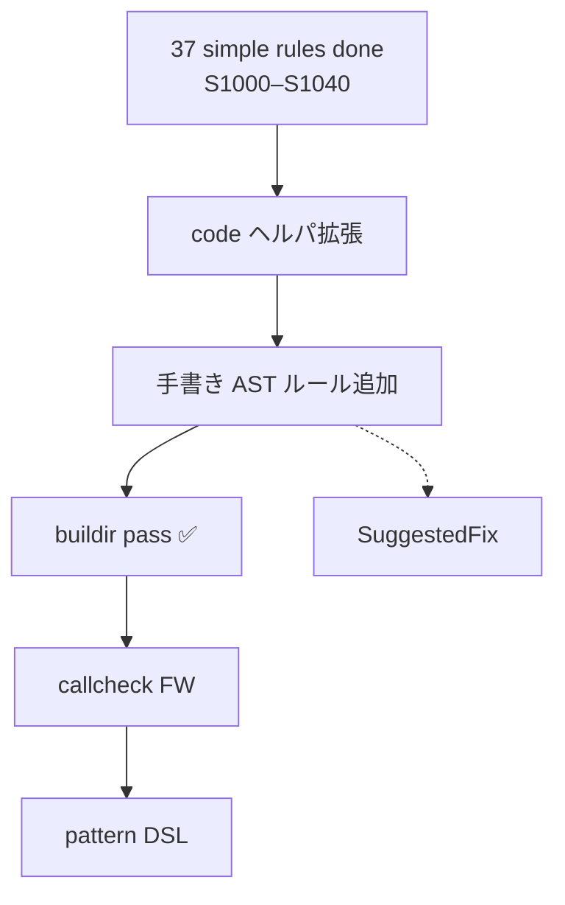

# guff — Staticcheck 移植 進捗・残タスク

> **目的**: 後続セッションが迷わず Staticcheck / simple analyzer の Rust 移植を
> 続けられるよう、**インフラ状態・移植済みルール・未着手タスク・作業手順**を
> 1 か所に集約する。
>
> **関連文書**:
> - [`PRE-LINTER-PLAN.md`](../PRE-LINTER-PLAN.md) — linter 基盤（Phase 0–8）の全体計画
> - [`docs/LINTER-MIGRATION.md`](LINTER-MIGRATION.md) — **govet / errcheck 等マルチ linter 移植の全体計画**
> - [`docs/ADDING-ANALYZER.md`](ADDING-ANALYZER.md) — 汎用 analyzer 追加手順
> - [`MIGRATION.md`](../MIGRATION.md) — `guff-types` 移植
> - [`projects/guff-ssa-MIGRATION.md`](../projects/guff-ssa-MIGRATION.md) — SSA 移植
>
> **Go 参照**:
> - Staticcheck 本体: `github.com/dominikh/go-tools`（`simple/`, `staticcheck/`）
> - ローカル clone 例: `/tmp/go-tools`（`git clone --depth 1` で取得可）
>
> **リポジトリ**: `/Users/dakimura/projects/src/github.com/dakimura/me/projects/guff`
> **最終更新**: 2026-07-14

---

## 0. セッション開始チェックリスト

1. この文書の **§2 進捗サマリ** と **§5 推奨ロードマップ** を読む。
2. [`PRE-LINTER-PLAN.md`](../PRE-LINTER-PLAN.md) §3 で基盤 Phase の状態を確認。
3. 着手するルールの **Go ソース**（`go-tools/simple/sXXXX/` または `staticcheck/saXXXX/`）を必ず `Read` する。
4. 作業後:
   - テスト件数を §2 に追記
   - セッション記録を §8 に 1 行追加
   - 新しい deferral があれば §7 に追記
5. **コミットはユーザー依頼時のみ**。push しない。

```bash
. "$HOME/.cargo/env"
cd /Users/dakimura/projects/src/github.com/dakimura/me/projects/guff

# Staticcheck 作業の基本
cargo test -p guff-staticcheck
cargo test -p guff-analysis -p guff-runner   # 基盤回帰

# 大きな変更後
cargo test -p guff-types -p guff-ssa -p guff-ast -q
```

---

## 1. 全体像

### 1.1 ゴール

golangci-lint の Rust 移植。Staticcheck はその中の **主要 linter 群**の 1 つ。
最終的には `honnef.co/go/tools` の simple（~37 ルール）+ staticcheck（~101 ルール）相当を
`guff-staticcheck` クレートに移植する。

### 1.2 アーキテクチャ（現状）

```
go list (guff-packages)
  → typecheck (guff-types + guff-exportdata)
  → Pass 生成 (guff-analysis)
  → Analyzer 実行 (guff-runner)
  → Diagnostic 収集
       ↑
  guff-staticcheck（個別ルール）
```

Staticcheck ルールは **`guff-staticcheck`** クレートに置く（`guff-analysis/passes/` は
スモーク用 `printast` / `printf` / `inspect` のみ）。

### 1.3 Go 側の依存インフラ（移植状況）

go-tools の各ルールが依存する共通層と、guff での対応:

| Go パッケージ | 用途 | guff 状態 | 影響ルール数（目安） |
|--------------|------|-----------|---------------------|
| `inspect` + AST walk | 全般 | ✅ `guff-analysis/passes/inspect` | — |
| `analysis/code` | CallName, 定数抽出等 | ✅ **`guff-analysis/code`**（最小セット） | 手書き移植の基盤 |
| `pattern` + `code.Match` | 構造パターンマッチ DSL | ✅ **`guff-pattern`** + `guff-analysis::matches` | ~52 |
| `typeindex` | 呼び出しサイト高速検索 | ❌ 未移植 | pattern 利用ルールの最適化 |
| `buildir` | パッケージ SSA/IR 構築 | ✅ **`guff-analysis/passes/buildir`**（`build_package_for_analysis`） | ~51 |
| `callcheck` | 関数呼び出し引数検証 FW | ✅ **`guff-analysis/callcheck`** | ~24 |
| `facts/generated` | 生成コード除外 | ✅ `guff-analysis/passes/facts/generated` + `is_generated_at` | 複数 |
| `facts/purity` | 純粋性 fact | ❌ | 少数 |
| `edit` / SuggestedFix | quickfix | ✅ `Diagnostic.suggested_fixes`（SA1004 例） | SA1004 等 |

---

## 2. 進捗サマリ（2026-07-13）

### 2.1 linter 基盤（PRE-LINTER-PLAN Phase 0–8）

| Phase | 状態 | テスト数 | メモ |
|-------|------|---------|------|
| 0 — types 仕上げ | ✅ P0-a–e 完了 | guff-types: ~760+ | initorder / no-new-vars / type-switch / FakeImportC / FileVersions |
| 1 — guff-build | ✅ 完了 | 33 | |
| 2 — guff-packages | ✅ 完了 | 30 | go list ドライバ |
| 3 — guff-exportdata | ✅ 完了 | 1+ | 読み取りのみ |
| 4 — packages↔types | ✅ 完了 | — | `typecheck_package`, `build_package_from_loaded` |
| 5 — guff-analysis | ✅ 完了 | **16** | +`code` モジュール、`buildir` pass、`generated` fact |
| 6 — guff-runner | ✅ 完了 | **7** | 5 unit + 2 smoke |
| 7 — E2E スモーク | ✅ 完了 | — | `docs/ADDING-ANALYZER.md` |
| 8 — 任意ユーティリティ | 未着手 | — | gofmt 等 |

**Phase 7 完了以降、Staticcheck 個別ルール移植に着手してよい**（PRE-LINTER-PLAN 記載どおり）。

### 2.2 Staticcheck ルール移植

| ルール | タイトル | 状態 | 実装方式 | テスト |
|--------|---------|------|---------|--------|
| **S1000** | `default` case 順序 | ✅ | 手書き CaseClause walk | `checks_test.rs` (2) |
| **S1001** | 不要な `else` | ✅ | 手書き IfStmt | `checks_test.rs` (2) |
| **S1004** | `strings.Replace` に `n < 0` | ✅ | 手書き CallExpr + `expr_to_int` | `checks_test.rs` (2) |
| **S1005** | 未使用 channel receive | ✅ | pattern + 手書きフォールバック | `checks_test.rs` (2) |
| **S1007** | 生文字列リテラル | ✅ | 手書き BasicLit + ヒューリスティック | `checks_test.rs` (2) |
| **S1010** | `s[x:len(s)]` → `s[x:]` | ✅ | pattern (`SliceExpr`) | `checks_test.rs` (2) |
| **S1011** | `time.Since` 省略 | ✅ | 手書き CallExpr + `type_func_name` | `checks_test.rs` (2) |
| **S1012** | `context.WithCancel` 未使用 | ✅ | 手書き AssignStmt + `object_of` | `checks_test.rs` (2) |
| **S1016** | 不要な型変換 | ✅ | 手書き CallExpr + types | `checks_test.rs` (2) |
| **S1018** | `strings.Index` に空文字列 | ✅ | pattern (`CallExpr`) | `checks_test.rs` (2) |
| **S1019** | `make` に負の size/cap | ✅ | 手書き CallExpr + `expr_to_int` | `checks_test.rs` (2) |
| **S1020** | `ListenAndServe` に `":http"` | ✅ | 手書き CallExpr | `checks_test.rs` (2) |
| **S1024** | `time.Now().Sub` → `time.Since` | ✅ | pattern (`CallExpr`) | `checks_test.rs` (2) |
| **S1025** | 不要な `fmt.Sprintf` | ✅ | 手書き CallExpr | `checks_test.rs` (2) |
| **S1028** | `errors.New(fmt.Sprintf(...))` | ✅ | pattern (`CallExpr`) | `checks_test.rs` (2) |
| **S1030** | `strconv.Itoa` に `int32`/`int64` | ✅ | 手書き CallExpr + types | `checks_test.rs` (2) |
| **S1031** | `hex.Encode` に奇数長 | ✅ | 手書き CallExpr + `len` | `checks_test.rs` (2) |
| **S1033** | `io.Copy` に同一 reader/writer | ✅ | 手書き CallExpr + `same_expr` | `checks_test.rs` (2) |
| **S1034** | 二重 `[]byte`→`string` 変換 | ✅ | 手書き CallExpr + types | `checks_test.rs` (2) |
| **S1035** | `redundant type in conversion` | ✅ | 手書き CallExpr + types | `checks_test.rs` (2) |
| **S1036** | map アクセスの不要な guard | ✅ | 手書き IfStmt（append/+=/++） | `checks_test.rs` (2) |
| **S1037** | `select` で `time.After` | ✅ | 手書き SelectStmt | `checks_test.rs` (2) |
| **S1038** | `errors.Is` に非 error 型 | ✅ | 手書き CallExpr + types | `checks_test.rs` (2) |
| **S1039** | `fmt.Errorf` に非 error 引数 | ✅ | 手書き CallExpr + types | `checks_test.rs` (2) |
| **S1040** | 未使用の結果を捨てる `append` | ✅ | 手書き CallExpr + `object_of` | `checks_test.rs` (2) |
| **S1017** | `HasPrefix` + 手動 trim → `TrimPrefix` | ✅ | 手書き IfStmt + `same_non_dynamic` | `checks_test.rs` (2) |
| **S1021** | `var x T` + 次行 `x =` 統合 | ✅ | 手書き BlockStmt + `object_of` | `checks_test.rs` (2) |
| **S1029** | `range []rune(s)` → `range s` | ✅（AST 簡易版） | RangeStmt + types（本家は buildir IR） | `checks_test.rs` (2) |
| **S1032** | `sort.Sort(IntSlice)` → `sort.Ints` | ✅ | 手書き ExprStmt + `selector_name` | `checks_test.rs` (2) |
| **S1002** | bool 定数比較の省略 | ✅ | 手書き AST + types | `s1002_test.rs` (2) |
| **S1003** | `strings.Index` → `Contains` | ✅ | 手書き BinaryExpr + types | `checks_test.rs` (2) |
| **S1006** | `for true` → `for {}` | ✅ | 手書き ForStmt + `is_bool_const` | `checks_test.rs` (2) |
| **S1008** | return bool 式簡略化 | ✅ | 手書き BlockStmt 末尾パターン + `negate` | `checks_test.rs` (2) |
| **S1009** | `x != nil && len(x)` 冗長 | ✅ | 手書き BinaryExpr パターン + types | `checks_test.rs` (2) |
| **S1023** | 冗長 `break`/`return` | ✅ | 手書き CaseClause / FuncDecl | `checks_test.rs` (2) |
| **SA1004** | `time.Sleep(1)` ナノ秒バグ | ✅ | `code::is_call_to` + 整数リテラル | `checks_test.rs` (2) |
| **SA1000** | 不正な正規表現 | ✅ | callcheck + buildir + `regex` crate | `checks_test.rs` (2) |
| **SA1002** | 不正な `time.Parse` layout | ✅（ヒューリスティック） | callcheck + buildir | `checks_test.rs` (2) |
| **SA1018** | `strings.Replace` に `n == 0` | ✅ | callcheck + buildir | `checks_test.rs` (2) |
| **SA1024** | Trim cutset の重複文字 | ✅ | callcheck + buildir | `checks_test.rs` (2) |
| **SA1010** | `FindAll` に `n == 0` | ✅ | callcheck + buildir + `type_func_name` | `checks_test.rs` (2) |
| **SA1011** | invalid UTF-8 cutset | ✅（部分） | callcheck + buildir | unit + `checks_test.rs` (1 ignore) |
| **SA1020** | `net.Listen` host:port 検証 | ✅ | callcheck + buildir | `checks_test.rs` (2) |
| **SA1007** | 不正な `net/url.Parse` URL | ✅（近似） | callcheck + buildir + `url` crate | `checks_test.rs` (2) |
| **SA1014** | `Unmarshal` に非ポインタ | ✅ | callcheck + SSA 型 | `checks_test.rs` (2) |
| **SA1021** | `bytes.Equal` で `net.IP` 比較 | ✅ | callcheck + SSA 型 | `checks_test.rs` (2) |
| **SA1028** | `sort.Slice` を非 slice に | ✅ | callcheck + SSA 型 | `checks_test.rs` (2) |
| **SA1029** | `context.WithValue` の不適切な key | ✅ | callcheck + SSA 型 | `checks_test.rs` (2) |
| **SA1017** | `signal.Notify` に unbuffered chan | ✅ | callcheck + `MakeChan` SSA | `checks_test.rs` (2) |
| **SA1012** | nil `context.Context` 渡し | ✅ | 手書き CallExpr + types | `checks_test.rs` (2) |
| **SA1013** | `io.Seeker.Seek` 引数順 | ✅ | 手書き CallExpr + selections | `checks_test.rs` (2) |
| **SA1026** | JSON/XML marshal 不可型 | ✅（部分） | callcheck + `fakejson` | `checks_test.rs` (2) |
| **SA1003** | `binary.Write` 非対応型 | ✅ | callcheck + SSA 型 | `checks_test.rs` (2) |
| **SA1030** | 不正な `strconv` 引数 | ✅ | callcheck + 定数検証 | `checks_test.rs` (2) |
| **SA1032** | `errors.Is` 引数順 | ✅ | callcheck + SSA global | `checks_test.rs` (2) |
| **SA1005** | `exec.Command` に shell 風引数 | ✅ | 手書き CallExpr + `expr_to_string` | `checks_test.rs` (2) |
| **SA1006** | 動的 format の `Printf` 系 | ✅ | 手書き CallExpr + types | `checks_test.rs` (2) |
| **SA1008** | `http.Header` の非 canonical key | ✅ | 手書き IndexExpr + `CanonicalMIMEHeaderKey` 移植 | `checks_test.rs` (2) |
| **SA1016** | トラップ不可 signal | ✅ | 手書き CallExpr + `selector_name` | `checks_test.rs` (2) |
| **SA1027** | 32-bit での atomic 64-bit アライメント | ✅ | callcheck + FieldAddr + `Sizes::offsetsof` | `checks_test.rs` (3) |
| **SA1031** | エンコード時の重複バイトスライス | ✅ | callcheck + SSA `Slice` + Phi flatten | `checks_test.rs` (2) |

**合計: 137 / 137 ルール（simple 37 + staticcheck SA 100）**

upstream `go-tools`（2026-07）と照合すると **SA パッケージは 101 件すべて登録済み**（guff は upstream 削除済み SA4002/4007/5006 を除き 100 件を移植）。
旧ドキュメントにあった **SA4002 / SA4007 / SA5006** は upstream から削除済み（現行 Staticcheck には存在しない）。
**SA5007**（無限再帰）・**SA5009**（Printf 検証）・**SA5001**（Close defer）は既に移植済み。
**SA5011**（possible nil pointer dereference）は upstream では `panic` で無効化されているが、guff では簡略 SSA 版を実装。

`guff-staticcheck` テスト内訳（2026-07-13）:
- lib unit: **147**
- `checks_test.rs`: **260**（うち 1 `#[ignore]` — SC-D08 / SA1011）
- `s1002_test.rs`: **2**
- **計 409 tests**（実行 408、1 ignore）

**simple analyzer（S1xxx）: 37/37 完了（SC-01 完了）**

---

## 3. 移植済みルール詳細

### 3.1 ファイル配置

```
crates/guff-staticcheck/
  src/
    lib.rs           # analyzers() 登録
    s1000.rs … s1040.rs   # simple 全 37 ルール
    sa1000.rs
    sa1002.rs
    sa1003.rs
    sa1004.rs
    sa1007.rs
    sa1010.rs
    sa1011.rs
    sa1014.rs
    sa1018.rs
    sa1020.rs
    sa1021.rs
    sa1024.rs
    sa1026.rs
    sa1027.rs
    sa1028.rs
    sa1029.rs
    sa1030.rs
    sa1031.rs
    sa1032.rs
    render.rs        # 診断メッセージ用 Expr レンダラ
  tests/
    support.rs       # typecheck + runner ヘルパ（後述）
    checks_test.rs   # simple + SA 統合テスト（112 件）
    s1002_test.rs
    testdata/
      s1000/ … s1040/   # 各ルール bad.go / ok.go / stub/（stdlib 依存時）
      sa1004/        # stub/time 依存
      sa1000/        # stub/regexp 依存
      sa1002/        # stub/time 依存
      sa1018/        # stub/strings 依存
      sa1024/        # stub/strings 依存
      sa1010/        # stub/regexp 依存
      sa1011/        # stub/strings 依存（SC-D08）
      sa1020/        # stub/net/http 依存
      sa1007/        # stub/net/url 依存
      sa1014/        # stub/encoding/json 依存
      sa1021/        # stub/bytes + stub/net 依存
      sa1028/        # stub/sort 依存
      sa1029/        # stub/context 依存
      sa1003/        # stub/encoding/binary 依存
      sa1030/        # stub/strconv 依存
      sa1031/        # stub/encoding/hex 依存
      sa1032/        # stub/errors + stub/io 依存
      sa1027/        # stub/sync/atomic 依存

crates/guff-analysis/
  src/
    callcheck.rs     # SC-11 callcheck フレームワーク
    pattern_match.rs # `matches` / `match_pattern` / `match_pos`
    passes/buildir.rs

crates/guff-pattern/
  src/lexer.rs, parser.rs, pattern.rs, match.rs
```

### 3.2 共通ヘルパ `guff-analysis::code`

`crates/guff-analysis/src/code.rs` — Staticcheck の `analysis/code` 最小移植:

| 関数 | 用途 |
|------|------|
| `call_name` / `func_name` | `"time.Sleep"` 形式の完全修飾名 |
| `type_func_name` | Go `typeutil.FuncName` 相当（`(*T).Method` 含む） |
| `is_call_to` / `is_call_to_any` | 呼び出し先判定 |
| `expr_to_int` / `expr_to_string` | 定数抽出 |
| `is_nil` / `is_bool_const` / `bool_const` | nil / bool 定数判定 |
| `is_integer_literal` | 整数定数リテラル一致 |
| `is_generated_at` | 生成ファイル判定（`report_unless_generated` 用） |
| `predeclared_bool_ident` | 組込み `true`/`false` 判定（S1008） |

**Pass 拡張**: `report_unless_generated(pos, msg)` — `FilterGenerated` 相当。

**未移植の code ヘルパ**（必要になったら追加）:
- `IsGenerated` / `FilterGenerated`（→ `is_generated_at` + `report_unless_generated` で **部分対応済**）
- `Preorder` / `PreorderStack`（→ `inspect::InspectResult::preorder` で代替）
- `Matches` / `Match`（→ pattern DSL または手書き）
- `IntegerLiteral` / `IsIntegerLiteral`
- `LanguageVersion` / `StdlibVersion`
- `MayHaveSideEffects` + purity

**callcheck 拡張**（2026-07-12）: `ssa_value_type`, `is_pointer_or_interface_type`,
`is_slice_type`, `is_converted_from_type`, `is_nil_const`, `builtin_key_type`,
`is_empty_struct_type`, `is_comparable_type`, `render_type`, `loaded_global`,
`global_import_path`, `flatten_ssa_value`, `flatten_ir_value` (Phi), `field_addr_from_value`,
`slice_from_value`, `slice_bounds_equal`, `is_ssa_const`, `call_target_name`,
`SsaValue::new`; `CallContext::pkg_path`, `CallContext::sizes`

### 3.3 ルール別メモ

#### S1002 — omit comparison with boolean constant
- Go: `simple/s1002`
- Requires: `inspect` + types
- 比較演算子 `==`/`!=` と bool 定数を検出
- 参考: 最初の移植例。pattern 不要。

#### S1003 — replace strings.Index with strings.Contains
- Go: `simple/s1003`
- Requires: `inspect` + types
- `strings`/`bytes` の `Index`/`IndexRune`/`IndexAny` と `-1`/`0` 比較を `Contains*` へ
- **未対応**: SuggestedFix

#### S1006 — use for {} for infinite loops
- Go: `simple/s1006`
- Requires: `inspect` + types
- `for true {}`（init/post なし）を検出

#### S1008 — simplify returning boolean expression
- Go: `simple/s1008`
- Requires: `inspect` + types + commentmap
- パターン: ブロック末尾が `if cond { return true/false }; return false/true`
- `negate()`: 比較演算子反転、`len(x) > 0` → `len(x) == 0` 特例
- 除外: `if` init/else あり、連続 if 列（3 文目以前が IfStmt）、コメント付き、生成コード
- **未対応**: Go 版の `generated.Analyzer` fact（`report_unless_generated` でファイル単位フィルタ）

#### S1009 — omit redundant nil check
- Go: `simple/s1009`
- Requires: `inspect` + types
- `x == nil || len(x) ...` / `x != nil && len(x) ...` パターン（slice/map/chan のみ）
- **依存**: `guff-types` nil 比較（`NilValue` モード）が正しく動くこと

#### S1023 — omit redundant control flow
- Go: `simple/s1023`
- Requires: `inspect`
- switch case 末尾の冗長 `break`、戻り値なし関数末尾の冗長 `return`

#### SA1004 — suspiciously small constant in time.Sleep
- Go: `staticcheck/sa1004`
- Requires: `inspect` + types
- **整数リテラルのみ**（Go pattern `(IntegerLiteral value)` 相当）
  - 定数名 `const c1 = 1` は対象外
- 範囲: `0 < n <= 120`
- **未対応**: SuggestedFix（`n * time.Nanosecond` 等）

#### SA1000 — invalid regular expression
- Go: `staticcheck/sa1000`（**callcheck + buildir**）
- `regexp.*` 呼び出しの第 1 引数が文字列定数なら `regex` crate で検証
- **既知の差分**: Rust `regex` ≠ Go `regexp/syntax`（SC-D01）

#### SA1002 — invalid format in time.Parse
- Go: `staticcheck/sa1002`
- callcheck + buildir。layout 定数を `time.Parse(layout, layout)` 相当で検証
- **既知の差分**: 完全な Go `time` layout パーサではなくヒューリスティック（SC-D07）

#### SA1018 — strings.Replace with n == 0
- Go: `staticcheck/sa1018`
- callcheck + buildir。第 4 引数 `n` が整数定数 `0` のとき警告

#### SA1024 — duplicate characters in Trim cutset
- Go: `staticcheck/sa1024`
- callcheck + buildir。`strings.Trim*` の cutset 定数に重複文字があるとき警告

#### SA1010 — regexp FindAll with n == 0
- Go: `staticcheck/sa1010`
- callcheck + buildir。`(*regexp.Regexp).FindAll*` の第 2 引数 `n` が `0` のとき警告
- **依存**: `code::type_func_name`（メソッド呼び出しのルールキー）

#### SA1011 — invalid UTF-8 in strings cutset
- Go: `staticcheck/sa1011`
- callcheck + buildir。`strings.IndexAny` / `Trim*` 等の cutset 定数が UTF-8 不正のとき警告
- **既知の差分**: `\xNN` リテラルのバイト表現が Go と異なる（SC-D08）

#### SA1020 — invalid host:port for net/http listen
- Go: `staticcheck/sa1020`
- callcheck + buildir。`net/http.ListenAndServe*` の addr 定数を `SplitHostPort` + port 検証

#### SA1007 — invalid URL in net/url.Parse
- Go: `staticcheck/sa1007`
- callcheck + buildir。URL 定数を検証（Rust `url` crate、SC-D09）

#### SA1014 — non-pointer passed to Unmarshal/Decode
- Go: `staticcheck/sa1014`
- callcheck + SSA 型。第 2 引数が pointer/interface でないとき警告

#### SA1021 — bytes.Equal on net.IP
- Go: `staticcheck/sa1021`
- callcheck + SSA 型。両引数が `net.IP` のとき `bytes.Equal` を警告

#### SA1028 — sort.Slice on non-slice
- Go: `staticcheck/sa1028`
- callcheck + SSA 型。第 1 引数の underlying が slice でないとき警告

#### SA1029 — inappropriate context.WithValue key
- Go: `staticcheck/sa1029`
- callcheck + SSA 型。組込み型・空 struct・非 comparable な key を警告

#### SA1003 — unsupported argument to encoding/binary.Write
- Go: `staticcheck/sa1003`
- callcheck + SSA 型。固定サイズ型以外（`int`/`uint`/string/map 等）を警告

#### SA1030 — invalid strconv arguments
- Go: `staticcheck/sa1030`
- callcheck + 定数検証。`base`/`bitSize`/`fmt` の範囲・許容値を検証

#### SA1032 — wrong order of errors.Is arguments
- Go: `staticcheck/sa1032`
- callcheck + SSA global load。外部パッケージのエラー変数が第 1 引数のとき警告

#### SA1027 — atomic 64-bit alignment on 32-bit platforms
- Go: `staticcheck/sa1027`
- callcheck + `FieldAddr` + `Sizes::offsetsof`。`word_size == 4` のときのみ
- **未対応**: 配列/スライス index 経由のアドレス（Go も TODO）

#### SA1031 — overlapping dst/src in encoders
- Go: `staticcheck/sa1031`
- callcheck + SSA `Slice` 解析 + Phi flatten。`hex`/`ascii85`/`base32`/`base64` Encode

---

## 4. テスト戦略（Staticcheck 固有）

### 4.1 三層（PRE-LINTER-PLAN §2.5 踏襲）

| 層 | Staticcheck での使い方 |
|----|----------------------|
| Unit | `code.rs` の pure 関数、`*::tests` モジュール |
| Integration | `tests/support.rs` + testdata + `guff_runner::run_on_packages` |
| E2E | `#[ignore]` + `go list` パイプライン（stdlib export data 要）|

### 4.2 stdlib 依存の扱い

現状 `typecheck_package` 単体では **stdlib export data なし**。
Integration テストでは 2 方式:

**A. スタブパッケージ（推奨・現行）**

`Checker::add_dependency_source` で import path にソースを登録:

```rust
// tests/support.rs — typecheck_with_deps()
check.add_dependency_source("time", vec![parse(stub_time_go)]);
```

testdata 例:
- `sa1004/stub/time/sleep.go` — `package time` + `Sleep` + `Duration`
- `sa1000/stub/regexp/regexp.go` — `regexp` API スタブ

**B. go list + export data（将来）**

`cargo test -p guff-runner -- --ignored` で実 stdlib を使う E2E。
PL02 / PL07 deferral が解消されてから本格運用。

### 4.3 新ルールのテスト追加手順

1. `tests/testdata/<rule>/bad.go` — 診断が出るコード
2. `tests/testdata/<rule>/ok.go` — 診断が出ないコード
3. stdlib import が要る場合は `stub/` サブディレクトリ
4. `checks_test.rs` に `support::typecheck_with_deps` + `support::run_analyzer` で assert
5. `cargo test -p guff-staticcheck`

---

## 5. 推奨ロードマップ（残タスク）

### 5.1 優先度付き一覧



| 優先 | タスク ID | 内容 | ブロッカー | 解消ルール数 |
|------|-----------|------|-----------|-------------|
| **P1** | SC-01 | 手書き simple ルール追加 | なし | **完了**（37/37） |
| **P1** | SC-02 | `code` ヘルパ拡張（`IsGenerated` 報告フィルタ等） | なし | — | **部分完了**（`is_nil`, `is_bool_const`, `report_unless_generated`） |
| **P2** | SC-10 | **`buildir` analyzer** — `guff-ssa` を Pass result に載せる | PL05 | ~51 | **完了** |
| **P2** | SC-11 | **`callcheck` フレームワーク** | SC-10 | ~24 | **完了** |
| **P2** | SC-12 | SA1000 本格版（callcheck 経由） | SC-11 | 1 | **完了** |
| **P2** | SC-13 | callcheck ルール追加（SA1002 / SA1018 / SA1024 等） | SC-11 | 各 1 | **進行中**（21 件） |
| **P3** | SC-20 | **`pattern` DSL**（parser + matcher） | 工数大 | ~52 | **完了**（`guff-pattern`） |
| **P3** | SC-21 | `typeindex` analyzer（呼び出しインデックス） | 任意 | 最適化 |
| **P4** | SC-30 | SuggestedFix / quickfix（`edit` 相当） | — | **完了**（SA1004） |
| **P4** | SC-31 | `generated` fact analyzer | — | **完了** |
| — | SC-40 | stdlib E2E（go list 全パイプライン） | `#[ignore]` | **部分完了** |

### 5.2 次に移植しやすいルール

**simple（S1xxx）: 全 37 ルール移植済み。**

**staticcheck（SAxxxx）: upstream 現行 101 件すべて移植済み（SA5011 は upstream 無効化だが guff で簡略実装）。**

**pattern 利用の simple ルール**（5 件のみ pattern、残り手書き）:
- S1005, S1010, S1018, S1024, S1028

### 5.3 buildir / callcheck 実装メモ（SC-10, SC-11）

Go 参照:
- `internal/passes/buildir/buildir.go` — `ctrlflow` → `ir.NewProgram` → `Pkg.Build()`
- `analysis/callcheck/callcheck.go` — static call site 走査、IR 定数 → AST pos 報告

guff 既存資産:
- `guff-ssa::ssautil::build_package_from_loaded` — loaded Package から SSA 構築済み
- `guff-ssa/tests/build_from_loaded_test.rs` — golden テストあり

**SC-10 完了内容**（2026-07-12）:
1. `guff-analysis/src/passes/buildir.rs` — `BuildIrResult { prog, pkg, type_pkg, src_funcs }`
2. `guff-ssa::ssautil::build_package_for_analysis` — type artifacts を消費しない SSA 構築
3. `TypecheckArtifacts::snapshot()` — 非破壊 clone
4. `requires`: `inspect`（Go の `ctrlflow` は PL05 defer）
5. `guff-ssa/tests/build_for_analysis_test.rs` — artifacts 残存確認

**SC-11 完了内容**（2026-07-12）:
1. `guff-analysis/src/callcheck.rs` — `Call` / `Argument` / `run(pass, rules)`
2. IR `Call`/`Defer`/`Go` 命令に AST 位置を記録（`emit_with_pos`）
3. インポート stub 解決: `ensure_package_member`, `populate_imported_package_members`
4. `BuildIrResult.prog` を `Arc<Program>` 化（runner `clone_result` 対応）
5. SA1000 を callcheck 版に差し替え

**SC-13 着手**（2026-07-12）: SA1002, SA1018, SA1024 + 統合テスト

---

## 6. 新ルール追加レシピ

### 6.1 最小手順

1. Go ソースを読む: `go-tools/simple/sXXXX/sXXXX.go` 等
2. `crates/guff-staticcheck/src/sXXXX.rs` 作成
3. `lib.rs` に `pub mod` + `analyzers()` 登録
4. testdata + `checks_test.rs`（または専用 `sXXXX_test.rs`）
5. `validate(&[analyzer()])` unit test
6. `cargo test -p guff-staticcheck`

### 6.2 Analyzer 雛形

```rust
use std::sync::OnceLock;
use guff_analysis::passes::inspect;
use guff_analysis::{AnalysisResult, Analyzer, RunError, RunFn, Pass};

fn run(pass: &mut Pass<'_>) -> Result<Option<AnalysisResult>, RunError> {
    let inspect = pass
        .result_of::<inspect::InspectResult>(inspect::analyzer())
        .ok_or_else(|| "SXXXX requires inspect".to_string())?
        .clone();
    // inspect.preorder(pass.files(), |n| { ... });
    Ok(None)
}

pub fn analyzer() -> &'static Analyzer {
    static A: OnceLock<Analyzer> = OnceLock::new();
    A.get_or_init(|| Analyzer {
        name: "SXXXX",
        doc: "...",
        url: "https://staticcheck.dev/docs/checks/#SXXXX",
        run: run as RunFn,
        run_despite_errors: false,
        requires: vec![inspect::analyzer()],
        fact_types: vec![],
    })
}
```

### 6.3 types が必要なルール

- `pass.types_info()` + `pass.pkg().type_artifacts` を使う
- runner 実行時は `LoadMode::LOAD_SYNTAX`（または `types_load_mode()`）が必要
- テスト: `support::typecheck_with_deps` が artifacts まで埋める

---

## 7. Deferral / 既知の制限

| ID | 内容 | 影響 | 対応時期 |
|----|------|------|---------|
| SC-D01 | SA1000 が Rust `regex` 使用（Go regexp と非完全一致） | 稀な false +/- | Go syntax 移植 |
| SC-D07 | SA1002 layout 検証がヒューリスティック | 稀な false +/- | Go `time` layout パーサ移植 |
| SC-D08 | SA1011 が `\xNN` 文字列定数を Unicode スカラーとして保持 | `\xff` 等の統合テスト不可 | `guff-constant` バイト正確化 |
| SC-D09 | SA1007 が Rust `url` crate 使用（Go `net/url` と非完全一致） | 稀な false +/- | Go url パーサ移植 |
| SC-D10 | SA1026 `fakejson` が簡易版（Marshaler 判定・XML 専用ルール・field priority 未実装） | 一部ケース未検出 | `fakejson`/`fakexml` 本格移植 |
| SC-D11 | SA5011 は upstream 無効化チェックを簡略 SSA 版で実装（phi/sigma 非伝播のため false negative あり） | 分岐内ガード等 | 文書化のみ |
| SC-D02 | ~~SuggestedFix 未実装~~ | — | **完了**（SC-30 / SA1004） |
| SC-D03 | ~~stdlib 統合テストは stub 依存~~ | `#[ignore]` go list E2E 追加 | **部分完了**（SC-40） |
| SC-D04 | ~~`generated` fact analyzer 未配線~~ | — | **完了**（SC-31） |
| SC-D05 | pattern DSL | ✅ **`guff-pattern` 完了**（simple では 5 ルールのみ pattern 使用、残りは手書き） | SC-20 |
| SC-D06 | ~~callcheck 未移植~~ | — | **完了**（SC-11） |
| PL05 | ctrlflow / SSA inspect 拡張 | buildir の Go 互換 | PRE-LINTER-PLAN |
| PL02 | go 無し fallback driver | オフライン CI | PRE-LINTER-PLAN |
| PL11 | 真の並列 runner | 性能のみ | PRE-LINTER-PLAN |

---

## 8. セッション履歴

（新しいセッションほど上）

### 2026-07-14 — pattern エンジン照合バグ修正（`guff run` 実プログラム検証）

- **タスク**: 独立リポジトリ化後の実プログラム検証で判明した pattern 誤検出の修正
- **変更**（すべて `guff-pattern/src/match.rs`）:
  - `match_expr_node`/`match_ident_node`/`match_optional_stmt`/`match_optional_else` が `match_node_inner` の結果を**破棄**して常に成功を返していた。そのため `CallExpr` の関数部が未検証となり、`(CallExpr (Builtin "append") [_])`（SA4021）が **append 以外の任意の 1 引数呼び出し**（`os.Open(x)` / `fmt.Println(x)` / `uint(0)` 等）にマッチして誤検出。結果を伝播（`?`）するよう修正。
  - 破棄バグに隠れていた 2 件を併せて修正: `match_object`/`match_integer_literal` が `_`（ワイルドカード）で必ず None を返す件、`symbol_name_for_object` がセレクタ経由のパッケージ関数（`pkg.Func`）で「メソッド扱い→レシーバ無しで None」になる件。
- **影響**: SA4021 誤検出解消。pattern DSL を使う**全ルールが正確化**（回帰テストで露呈した **SA4009 / S1010 / S1024 / S1028 / SA4025** を含む）。
- **テスト**: guff-pattern / guff-staticcheck green（全ワークスペース 1806 tests）

### 2026-07-13 — Phase 0 完了 + SA1015/1019 + SC-30/31/40

- **タスク**: P0-a–e、`StdlibDeprecations`（SA1019）、SA1015 buildir 準備、SuggestedFix、generated fact、stdlib E2E
- **変更**:
  - `guff-types`: type switch cross-clause unused、`Config.fake_import_c`、`Info.file_versions`
  - `guff-analysis`: `SuggestedFix`/`TextEdit`、`passes/facts/generated`、`knowledge_selector_name`
  - `guff-staticcheck`: `stdlib_deprecations.rs`（187 件）、SA1019 版ゲート、SA1015 buildir+AST、SA1004 quickfix
  - `guff-runner/action.rs`: `GeneratedResult` clone
  - `guff-staticcheck/tests/stdlib_e2e.rs`（`go list` + SA1019、`#[ignore]`）
- **テスト**: guff-staticcheck **260** / guff-types +5 / guff-analysis +1
- **deferral**: SA1015 buildir は SSA `RangeStmt` 未実装のため inspect のみ require（buildir パスは result があるときのみ）
- **次**: SSA `RangeStmt`、SA1015 buildir を default require に戻す

### 2026-07-14 — staticcheck 完走確認

- **状態**: simple 37 + SA 100 = **137 analyzers** すべて移植済み。`stdlib_e2e` green。
- **残り**: `typeindex`（性能最適化のみ、機能ブロッカーではない）

- **タスク**: 残り SA ルール（SA5011）+ `StarExpr` 型チェック（buildir ブロッカー解消）
- **変更**:
  - `guff-types/expr.rs`: `StarExpr` 型チェック、`&*x` 用 unary `&` 緩和
  - `guff-ssa/builder/expr.rs`: `StarExpr` → `emit_load`
  - `guff-staticcheck`: `sa5011` + testdata
- **テスト**: guff-staticcheck **409**（1 ignore）、全 green
- **既知の簡略化**: SA5011 は upstream と同じ「trivial」実装（SC-D11）

### 2026-07-12 — SC-15 完了（SA 残り一括 + インフラ）

- **タスク**: SA1015/1019/1023/1025 優先 + SA2xxx/3xxx/4xxx/5xxx/6xxx/9xxx 残り ~68 ルール
- **インフラ**:
  - `guff-analysis`: `ssa_util`, `passes/facts/deprecated`（`IsDeprecated` / `DeprecatedResult`）
  - `guff-analysis/code.rs`: `stdlib_version`, `is_main_like`, `version_compare` 等
  - `guff-runner`: `requires` 側の `fact_types` アナライザを import パッケージでも実行
  - `guff-ast/parser.rs`: 先頭 doc コメントを `ParseComments` なしでも保持（SA1019 用）
  - `guff-types/arena.rs`: `PackageArena::find_by_path`
- **ルール**: SA1001, SA1015（AST）, SA1019, SA1023（AST）, SA1025（buildir）, SA2000–2003, SA3000–3001, SA4000–4032（4002/4007 除く）, SA5000–5012（5006/5011 除く）, SA6000–6006, SA9001–9010
- **テスト**: `checks_test.rs` +130、`support.rs` パッケージ名修正・import `PackageId` 共有
- **テスト合計**: guff-staticcheck **406**（1 ignore）、全 green
- **既知の簡略化**: SA1015 は SSA `RangeStmt` 未実装のため AST 版、SA1019 は `knowledge.StdlibDeprecations` 未移植

### 2026-07-12 — SC-14 着手（SA1005 / SA1006 / SA1008 / SA1016）

- **タスク**: staticcheck 残りバッチ 1（inspect 系 SA10xx 4 件）
- **変更**:
  - `guff-analysis/code.rs`: `is_of_type_with_name` ヘルパ追加
  - `guff-staticcheck`: `sa1005`, `sa1006`, `sa1008`, `sa1016` + testdata 4 セット
- **テスト**: guff-staticcheck **196**（1 ignore）
- **次**: SA1015（buildir + version）, SA1019（deprecated fact）, SA2xxx 着手

### 2026-07-12 — SC-01 完了（simple 全 37 ルール）

- **タスク**: SC-01 残り simple ルール 28 件（手書き 2 + pattern/手書き 26）
- **変更**:
  - `guff-pattern` crate + `guff-analysis::pattern_match`（`matches` / `match_pos`）
  - `guff-staticcheck`: `s1000`–`s1040`（新規 25 モジュール）+ testdata 25 セット
  - 手書き: S1000, S1001, S1004, S1007, S1011, S1012, S1016, S1019, S1020, S1025, S1030–S1039, S1040
  - pattern: S1005, S1010, S1018, S1024, S1028
- **テスト**: guff-staticcheck **182**（1 ignore）
- **次**: staticcheck（SAxxxx）残り ~78 ルール

### 2026-07-12 — SC-13 完了（SA1027 / SA1031）

- **タスク**: SC-13 最終バッチ（callcheck 系 SA10xx 残り 2 件）
- **変更**:
  - `guff-analysis/callcheck.rs`: Phi flatten、`FieldAddr`/`Slice` ヘルパ、`CallContext::sizes`
  - `guff-staticcheck`: `sa1027`, `sa1031` + testdata 2 セット
  - `tests/support.rs`: `typecheck_with_deps_and_sizes`
- **テスト**: guff-staticcheck **107**（1 ignore）
- **次**: SC-01（手書き simple）または SC-20（pattern DSL）

### 2026-07-12 — SC-13 継続（SA1003 / SA1030 / SA1032）

- **タスク**: SC-13 バッチ 4（残り SA10xx callcheck ルール 3 件）
- **変更**:
  - `guff-analysis/callcheck.rs`: `loaded_global`, `global_import_path`, `flatten_ssa_value`, `CallContext::pkg_path`
  - `guff-staticcheck`: `sa1003`, `sa1030`, `sa1032` + testdata 3 セット
- **テスト**: guff-staticcheck **100**（1 ignore）
- **次**: SC-13 継続（SA1027, SA1031）または SC-01（手書き simple）

### 2026-07-12 — ブロッカー解消（MakeChan / SA1012–1013 / fakejson+SA1026）

- **タスク**: SC-13 ブロッカー 4 件
- **変更**:
  - `guff-ssa/builder/call.rs`: `make` builtin → `MakeChan`/`MakeMap`/`MakeSlice`（型引数を値評価しない）
  - `guff-ssa/instr.rs`, `print.rs`: `MakeChan`/`MakeSlice` オペランド・逆アセンブル
  - `guff-analysis/callcheck.rs`: `is_unbuffered_make_chan`
  - `guff-analysis/code.rs`: `call_target_object`, `first_param_type`, `is_method_val`, `is_io_seek_whence`
  - `guff-staticcheck`: `sa1017`, `sa1012`, `sa1013`, `sa1026`, `fakejson` + testdata 4 セット
- **テスト**: guff-staticcheck **90**（1 ignore）
- **deferral**: SC-D10（fakejson 簡易版）
- **次**: SC-13 継続（残り SA ルール）

### 2026-07-12 — SC-13 継続（SA1007 / SA1014 / SA1021 / SA1028 / SA1029）

- **タスク**: SC-13 バッチ 2
- **変更**:
  - `guff-analysis/callcheck.rs`: SSA 型ヘルパ（`ssa_value_type`, `is_comparable_type` 等）
  - `guff-ssa/program.rs`: `value_type_of` を公開
  - `guff-staticcheck`: `sa1007`, `sa1014`, `sa1021`, `sa1028`, `sa1029` + testdata 5 セット
  - `url` crate 追加（SA1007）
- **テスト**: guff-staticcheck **79**（1 ignore）/ guff-analysis **15**
- **deferral**: SC-D09（SA1007 URL 検証）
- **次**: SC-13 継続（残り SA ルール）

### 2026-07-12 — SC-13 継続（SA1010 / SA1011 / SA1020）+ callcheck メソッド対応

- **タスク**: SC-13（SA1010, SA1011, SA1020）
- **変更**:
  - `guff-analysis/code.rs`: `type_func_name`（Go `typeutil.FuncName`）
  - `guff-analysis/callcheck.rs`: メソッド呼び出し解決（`resolve_call_target`）
  - `guff-staticcheck`: `sa1010`, `sa1011`, `sa1020` + testdata 3 セット
- **テスト**: guff-staticcheck **63**（1 ignore）/ guff-analysis **15**
- **deferral**: SC-D08（SA1011 文字列定数バイト表現）
- **次**: SC-13 継続（SA1012 等）または SC-01（S1011 手書き）

### 2026-07-12 — SC-11 callcheck + SC-12/13 ルール 4 件

- **タスク**: SC-11, SC-12, SC-13（SA1000 本格版, SA1002, SA1018, SA1024）
- **変更**:
  - `guff-analysis/callcheck.rs` 新規、`passes/buildir.rs`（`Arc<Program>`）
  - `guff-runner/action.rs`: `BuildIrResult` clone パス
  - `guff-ssa`: Call/Defer/Go 位置、`ensure_package_member`、import 走査（`object_arena` ベース）
  - `guff-staticcheck`: `sa1000` callcheck 化、`sa1002`, `sa1018`, `sa1024` + testdata
- **テスト**: guff-staticcheck **52** / guff-analysis **15** / guff-ssa build_stub_import **2**
- **deferral**: SC-D07（SA1002 layout ヒューリスティック）
- **次**: SC-13 継続（SA1010, SA1011 等）または SC-01（S1011 手書き）

### 2026-07-12 — SC-10 buildir + SC-01 手書き 4 件

- **タスク**: SC-10（`buildir` pass）、SC-01（S1017 / S1021 / S1029 / S1032）
- **変更**:
  - `guff-analysis/passes/buildir.rs`、`guff-ssa::build_package_for_analysis`
  - `guff-staticcheck`: `s1017`, `s1021`, `s1029`, `s1032` + testdata 4 セット
  - `guff-analysis/code.rs`: `object_of`（defs+uses）、`selector_name`（PkgName）、`same_non_dynamic` 修正
  - `guff-types/arena.rs` + `package.rs`: Clone / snapshot 対応
- **テスト**: guff-staticcheck **41** / guff-analysis **15** / guff-ssa build_for_analysis **1**
- **メモ**: S1029 は AST 簡易版（SSA `RangeStmt` 未実装のため buildir 非依存）
- **次**: SC-11（callcheck）または SC-01 継続（S1011 等）

### 2026-07-12 — SC-01 手書きルール 4 件 + SC-02 code ヘルパ拡張

- **タスク**: SC-01（S1003 / S1006 / S1009 / S1023）、SC-02（`code` 拡張、`report_unless_generated`）
- **変更**:
  - `guff-staticcheck`: `s1003`, `s1006`, `s1009`, `s1023` + testdata 4 セット
  - `guff-analysis/code.rs`: `is_nil`, `is_bool_const`, `bool_const`, `is_integer_literal`, `is_generated_at`
  - `guff-analysis/pass.rs`: `report_unless_generated`
  - `guff-types/expr.rs`: nil 比較修正（`NilValue` モード + `match_types` nil ショートサーキット）
- **テスト**: guff-staticcheck **29** / guff-analysis **13**
- **次**: SC-01 継続（S1011 等）または SC-10（buildir）

### 2026-07-12 — Staticcheck 初回バッチ（S1008 / SA1004 / SA1000 + code ヘルパ）

- **タスク**: SC ロードマップ Phase A（手書きルール 3 件 + 共通基盤）
- **変更**:
  - `guff-analysis/src/code.rs` 新規
  - `guff-staticcheck`: `s1008`, `sa1004`, `sa1000`, `render.rs`
  - `tests/support.rs`, `tests/checks_test.rs`, testdata 3 セット
  - `regex` crate 追加（SA1000）
- **テスト**: guff-staticcheck **16** / guff-analysis **13**
- **deferral**: SC-D01–D06
- **次**: SC-01（S1001/S1003/S1009 等）または SC-10（buildir）

### 2026-07-12 — S1002 移植（最初の Staticcheck ルール）

- **タスク**: Staticcheck 移植着手
- **変更**: `guff-staticcheck` クレート新規、`s1002.rs`
- **テスト**: guff-staticcheck 2（s1002_test のみ）
- **次**: ロードマップ策定 → 上記バッチ

### 2026-07-12 — Phase 7 完了（linter 基盤）

- **タスク**: P7-a–c（printast / printf スモーク、`ADDING-ANALYZER.md`）
- **テスト**: guff-runner 7 / guff-analysis 12
- **次**: Staticcheck 個別ルール移植

---

## 9. クイックリファレンス

### 9.1 主要パス

| 用途 | パス |
|------|------|
| Staticcheck ルール | `crates/guff-staticcheck/src/*.rs` |
| 共通 code ヘルパ | `crates/guff-analysis/src/code.rs` |
| inspect pass | `crates/guff-analysis/src/passes/inspect.rs` |
| runner | `crates/guff-runner/src/runner.rs` |
| テスト support | `crates/guff-staticcheck/tests/support.rs` |
| Go 参照 clone | `git clone --depth 1 https://github.com/dominikh/go-tools` |

### 9.2 よく使うコマンド

```bash
# Staticcheck クレートのみ
cargo test -p guff-staticcheck

# 特定テスト
cargo test -p guff-staticcheck s1008

# analyzer グラフ検証（各ルールの tests に含まれる）
cargo test -p guff-staticcheck s1002_validates

# go list E2E（要 go toolchain）
cargo test -p guff-runner -- --ignored
```

### 9.3 Go ルール数（参考）

```
go-tools/simple/       ~37 パッケージ（S1xxx）
go-tools/staticcheck/ ~101 パッケージ（SAxxxx 等）
```

依存インフラ別（`/tmp/go-tools` で `rg` 集計、2026-07-12）:
- `pattern.MustParse` 使用: ~52
- `buildir.Analyzer` 使用: ~51
- `callcheck.Analyzer` 使用: ~24
- 上記 3 つすべて不使用: ~34（手書き移植向き）

---

## 10. PRE-LINTER-PLAN との関係

- **Phase 0–7 完了** → Staticcheck 移植は **アンブロック済み**
- **Phase 8**（gofmt 等）と Staticcheck 移植は **並行可**
- Staticcheck 固有の進捗は **この文書（§2.2, §5, §8）** で管理
- 基盤 Phase の進捗は引き続き **PRE-LINTER-PLAN §3–§5** で管理
- 新規 deferral で PRE-LINTER 層に影響するもの（buildir → PL05 等）は両方に記載

---

*この文書は Staticcheck 移植セッション終了時に更新すること。*
